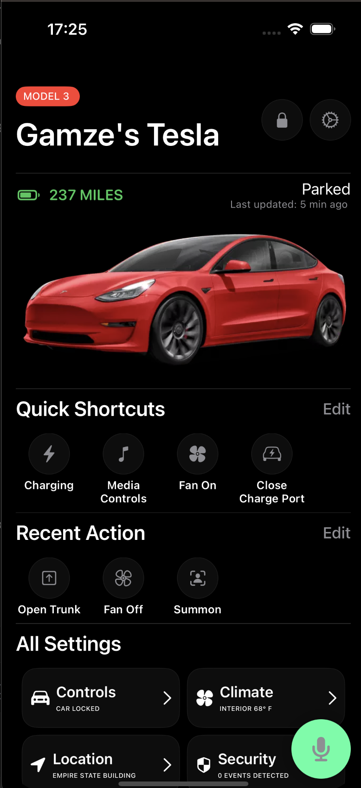
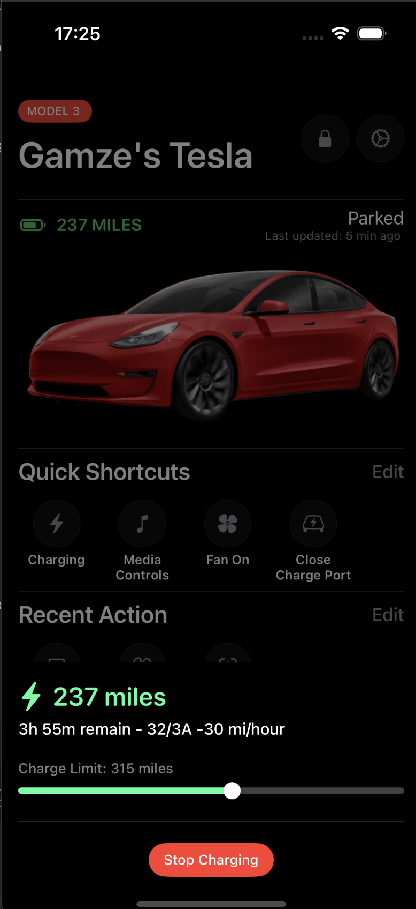
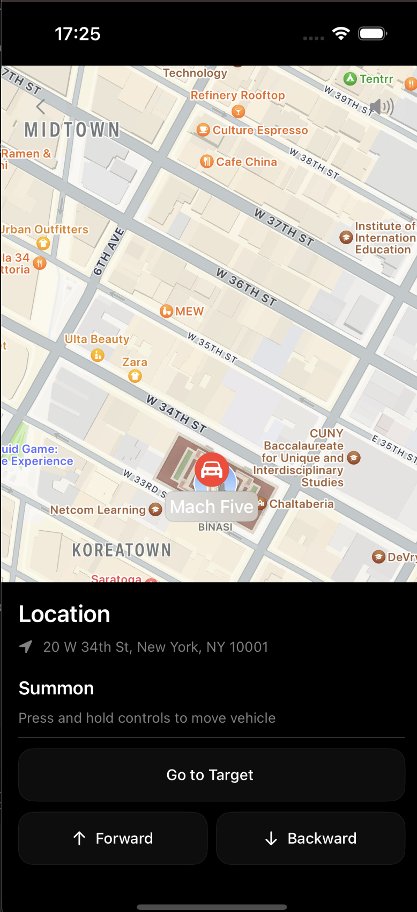
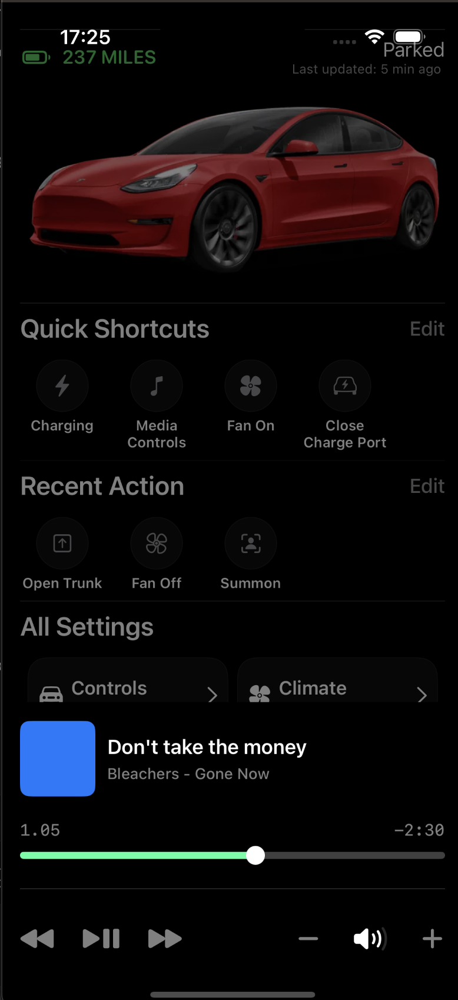

🚗 Tesla UI Clone – Built with SwiftUI

This project is a Tesla mobile app interface clone built using SwiftUI. It replicates the look and feel of the official Tesla app, offering a clean, modern, and interactive user interface.

📱 Features
	•	🔋 Battery status display
	•	🚗 Vehicle controls (e.g. lights, horn, lock/unlock)
	•	🧭 Location map and basic navigation simulation
	•	🧪 Fully built using SwiftUI components

🎯 Purpose

This is a learning project designed for developers who want to practice building iOS apps using SwiftUI. It covers:
	•	UI layout and design
	•	State management
	•	Navigation
	•	Animations

🛠️ Technologies Used
	•	Swift 5
	•	SwiftUI
	•	Xcode 15+

🖼️ Screenshots

 

  

 

 

